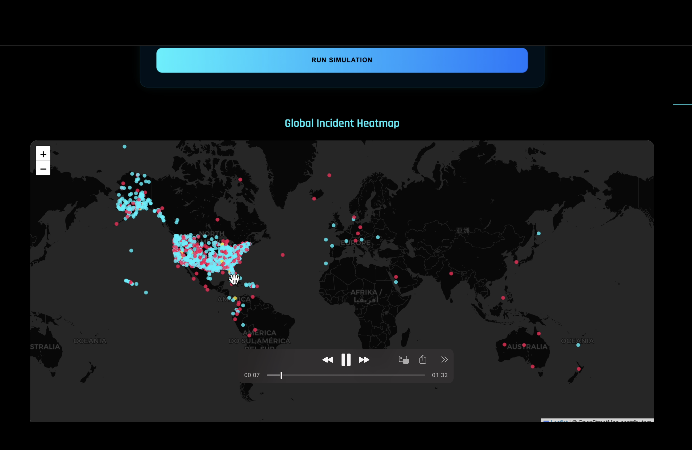
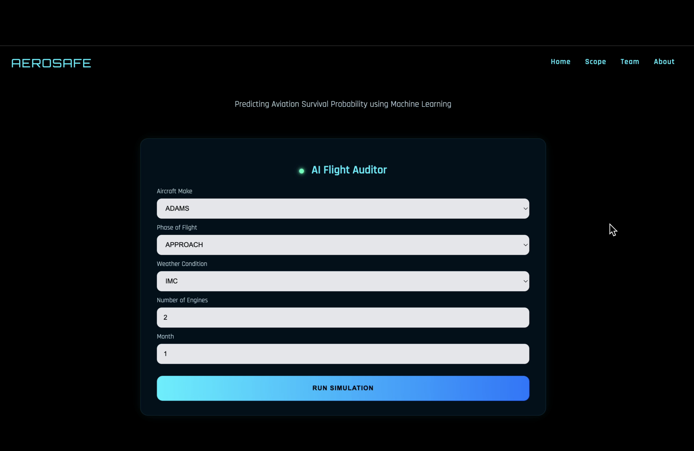
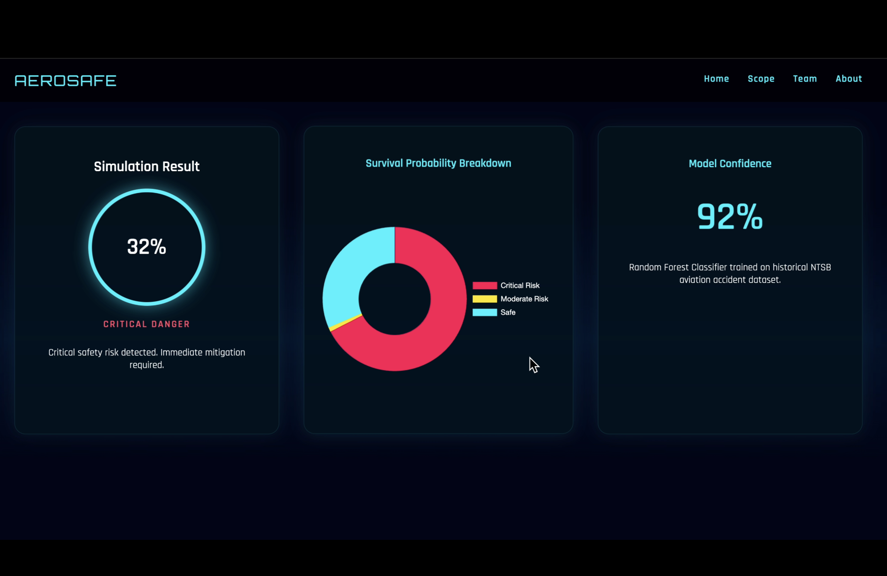

# Passenger Survival Prediction in Aviation Accidents

A machine learning-based web application that predicts passenger survival probability in aviation accidents using historical aviation safety data.

This project combines data analysis, machine learning, and web development to provide real-time risk predictions based on accident conditions.

---

## Features

- Predicts passenger survival probability using Machine Learning
- Interactive web interface built with Flask
- Real-time prediction results
- Risk level classification (Low / Moderate / High)
- Aviation-style cockpit user interface
- Structured dataset preprocessing pipeline
- Model training using Logistic Regression and XGBoost

---

## Tech Stack

Backend:
- Python
- Flask
- Scikit-learn
- XGBoost
- Pandas
- NumPy

Frontend:
- HTML
- CSS
- JavaScript

Machine Learning:
- Logistic Regression
- XGBoost

---

## Project Structure

Passenger Survival Prediction/

app.py  
dataset/  
models/  
src/  
static/  
templates/  
requirements.txt  
README.md  

---

## Screenshots

### Home Page

---

### Input Form

---

### Result Page

---

## How It Works

1. User enters flight and accident parameters
2. Data is processed and cleaned
3. Machine learning model predicts survival probability
4. Risk level is calculated
5. Result is displayed to the user

---

## Model Information

Target Variable:

Survival Rate

Algorithms Used:

- Logistic Regression (baseline model)
- XGBoost (final model)

Evaluation Metrics:

- Accuracy
- Precision
- Recall
- F1 Score

---

## Future Enhancements

- Real-time aviation data integration
- Advanced machine learning models
- Risk visualization dashboard
- Cloud deployment
- API integration

---

## Author

Harshita  
Computer Science and Engineering (Artificial Intelligence)